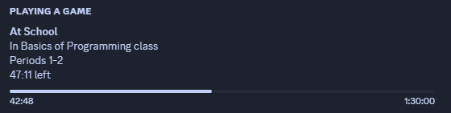

# classesJS
A simple node.js app to show what class you are currently in on Discord. 
Basically, a JavaScript rewrite of jarlold/DiscordOnlineClassRichPresence.

Example `classes.txt` file:

```txt
# Define period times with .define classTime
.define classTime 0 07:05 07:50
.define classTime 1 07:55 08:40
.define classTime 2 08:45 09:30
.define classTime 3 09:40 10:25
.define classTime 4 10:40 11:25
.define classTime 5 11:30 12:15
.define classTime 6 12:20 13:05
.define classTime 7 13:35 14:20
.define classTime 8 14:25 15:10
# classesJS automatically calculates periods, and shows them during class, as well as in breaks.

# TUESDAY
"Basics of Programming" tuesday 1 07:55 09:25
```



